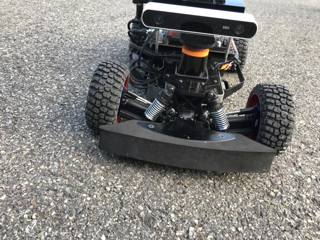
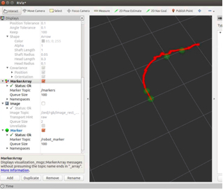
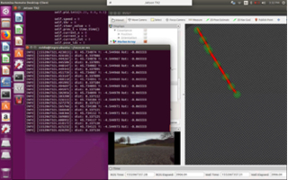
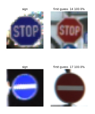

# Alejandro the Self-Driving RC Car

## Overview

Appearning at the Virginia State Science and Engineering Fair and nominated for the Office of Naval Research Naval Science Award and Yale Science & Engineering Association Award, Alejandro is the Self-Driving RC Car equipped with a low-computing-power, high-performance artifical intelligence that has the ability to drive in real-world vehicular environments. 

The purpose of this project is to show that self-driving vehicles can be made at a low-cost and still be able to mimic a competent driver. The main goal of this project is to provide a modular artificial intelligence for self-driving vehicle systems, so that self-driving vehicles can easily be implemented and used in our society to combat the high fatalaties from car accidents due to human-error.

Big thank you to all my friends and family that donated money to help me puruse this ambititious project!

## Robot Composition

* Traxxas RC car
* Jetson TX2
* Hokuyo LIDAR
* SparkFun 9DoF IMU
* Enertion FOCBOX VESC
* Zed Stereo Camera

Hardware to software connection code based off of [MIT's racecar](https://github.com/mit-racecar)

## Capabilites

* [Localization using Extended Kalman Filter (EKF)](https://github.com/AlexanderBurkhart/Alejandro/tree/master/src/racecar/alejandro_localization): combined sensor measurements into an EKF to accuratly find the position of the robot in any place.

* [PID Controller](https://github.com/AlexanderBurkhart/Alejandro/blob/master/src/racecar/autonomous/src/pid_controller.py) with Path Planning: Uses PID controller to manuever the robot to set waypoints.

* [Traffic Sign Detection and Classifier](https://github.com/AlexanderBurkhart/Alejandro/blob/master/src/racecar/autonomous/src/sign_finder.py): Uses two neural networks, one to detect and the other to classify. UNet architecutre is used for the detector and a custom CNN is used for the classifier. If altered, code can also be used to identify traffic signs, pedestrians, and other.

* Detect Obstacles with LIDAR sensor: Deacelerates to avoid collision with obstacles in a front 180 view. Comes to a stop if need be and can safely follow other vehicles at slower speeds.

## Roadmap

* Implement Monte-Carlo localization for more accurate localization
* Implement A* pathfinding for better navigation
* Use semantic segmentation for more effiecient and diverse detection of obstacles
* Use GPS to autonomitcally set waypoints based on the destinatation and current position
